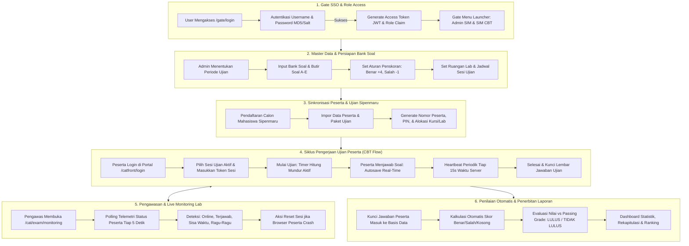
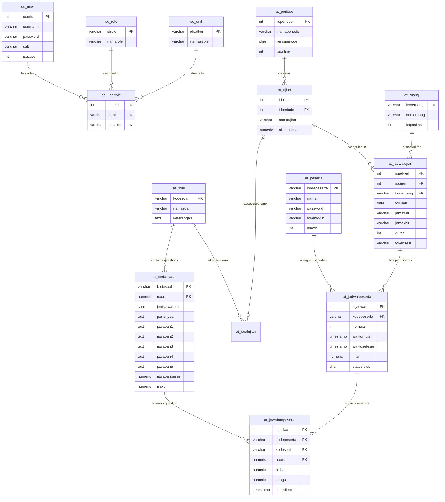

# Dokumentasi Arsitektur, Alur Bisnis & RESTful API SIM CAT Enterprise
**Poltekkes Kemenkes Surabaya**  
*Versi Dokumen: 2.1.0 | Engine Backend: Golang (Gin-Gonic) | Basis Data: PostgreSQL 14+*

---

## 1. Ikhtisar Arsitektur Sistem Backend

Backend **SIM CAT (Computer Assisted Test) Enterprise** dirancang menggunakan arsitektur **Feature-Driven Modular Monolith**. Setiap fitur bisnis utama diisolasi ke dalam modul independen dengan prinsip pemisahan tanggung jawab (*Separation of Concerns*):

```text
       [ HTTP Client (Browser / Mobile / Postman) ]
                           │
                           ▼
              [ Gin HTTP Router & Middleware ]
        (CORS, TraceID, JWT Auth, Recovery, Logging)
                           │
            ┌──────────────┴──────────────┐
            ▼                             ▼
   [ Admin Handler ]            [ Participant Handler ]
   (Role: admin, cat)            (Role: peserta ujian)
            │                             │
            ▼                             ▼
   [ DTO Validation ]            [ DTO Validation ]
            │                             │
            └──────────────┬──────────────┘
                           ▼
                  [ Service Layer ]
            (Logika Bisnis, Timer, Scoring,
             Anti-Cheat, State Management)
                           │
                           ▼
                [ Repository Layer ]
          (SQL Queries, Prepared Statements,
           Transactions, Locking Mechanism)
                           │
                           ▼
           [ PostgreSQL Database Engine ]
            (Schema: gate, cat, public)
```

### Lapisan Komponen (*Component Layers*):
1. **DTO (Data Transfer Object)**: Validasi kontrak input request JSON dan pemodelan output response yang aman dari kebocoran data sensitif.
2. **Handler Layer**: Menangani HTTP Request, ekstraksi parameter/header/token, dan pengembalian response standar enterprise.
3. **Service Layer**: Mengatur alur logika bisnis (misal: validasi token sesi, pengecekan kunci jawaban, penskoran otomatis $+4$ dan $-1$, penentuan passing grade, dan sinkronisasi timer).
4. **Repository Layer**: Berinteraksi dengan basis data PostgreSQL menggunakan `sqlx` dengan connection pool teroptimasi untuk menampung ribuan peserta bersamaan.

---

## 2. Diagram & Penjelasan Alur Bisnis (Business Process Flow)

Sistem SIM CAT memiliki 6 alur bisnis utama dari pra-ujian hingga pasca-ujian:



### Detail Penjelasan 6 Alur Bisnis:

#### 1. Alur Single Sign-On (Gate SSO)
- Seluruh pengguna (Superadmin, Administrator CBT, Pengawas) masuk melalui satu pintu gerbang `/api/v1/auth/login`.
- Password diverifikasi dengan algoritma MD5 bertingkat dengan salt database legacy.
- Token JWT diterbitkan memuat klaim hak akses (`admin`, `cat`) dan identitas unit kerja.
- Pengguna diarahkan ke Gate Launcher (`/gate/menu`) yang menampilkan modul yang diizinkan (Admin SIM dan SIM Computer Based Test).

#### 2. Alur Persiapan & Pengelolaan Master Data Ujian
- Admin mendefinisikan **Periode Ujian** (Semester, Mandiri, Jalur Prestasi).
- Admin menyusun **Bank Soal** yang berisi butir soal pilihan ganda A–E, kunci jawaban, dan materi multimedia (Gambar, Audio, Video).
- Fitur **Salin/Duplikasi Soal** memungkinkan pembuatan paket bank soal baru (misal: Paket B, Paket C) secara instan tanpa menginput ulang dari awal.
- Admin mengonfigurasi **Ruangan Lab Komputer** dan **Aturan Penskoran** (Benar $+4$, Salah $-1$, Kosong $0$).

#### 3. Alur Sinkronisasi & Pendaftaran Peserta
- Data ujian dan pendaftar dari sistem Sipenmaru Poltekkes diintegrasikan ke tabel `cat.at_peserta` dan `cat.at_jadwalpeserta`.
- Setiap peserta memiliki Nomor Peserta unik, ruangan lab, meja komputer, dan sesi ujian yang telah ditentukan.

#### 4. Alur Siklus Pengerjaan Ujian Peserta (CBT Exam Flow)
1. **Login Peserta**: Peserta login di portal publik `/catfront/login` menggunakan Nomor Peserta dan PIN/Password.
2. **Verifikasi Token Sesi**: Peserta memilih sesi ujian yang dijadwalkan dan memasukkan Token Sesi yang diumumkan pengawas lab.
3. **Mulai Ujian (`/exams/participant/start`)**: Server mencatat waktu mulai, memuat butir soal, dan menginisialisasi timer mundur pengerjaan.
4. **Autosave Real-Time (`/exams/participant/answers/save`)**: Setiap kali peserta mengklik opsi jawaban (A–E) atau menandai "Ragu-Ragu", sistem langsung menyimpan jawaban ke basis data secara asinkron tanpa memuat ulang halaman.
5. **Heartbeat Server Time (`/exams/participant/heartbeat`)**: Client browser mengirim sinyal detak jantung periodik untuk menyelaraskan sisa waktu dengan server dan mencegah manipulasi jam lokal pada komputer peserta.
6. **Submit & Finish (`/exams/participant/:id/finish`)**: Peserta menekan tombol "Selesai Ujian", lembar jawaban dikunci secara permanen, dan status ujian berubah menjadi `COMPLETED`.

#### 5. Alur Pengawasan Ujian Real-Time (Live Telemetry Monitoring)
- Pengawas ruangan memantau ruang lab melalui halaman `/cat/exam/monitoring`.
- Halaman mengambil telemetri langsung dari server: jumlah soal yang telah dijawab tiap peserta, sisa waktu aktif, dan status koneksi (*CONNECTED* / *IDLE*).
- Jika terjadi kendala teknis (komputer hang, browser tertutup tidak wajar), Admin/Pengawas dapat menekan tombol **Reset Sesi** (`POST /peserta/reset-login`) agar peserta dapat login kembali dan melanjutkan ujian tanpa kehilangan jawaban yang telah tersimpan.

#### 6. Alur Penilaian Otomatis, Rekapitulasi & Ranking
- Begitu ujian selesai, sistem secara otomatis mengevaluasi seluruh jawaban terhadap kunci soal:
  $$\text{Skor Akhir} = (\text{Jumlah Benar} \times \text{Skor Benar}) + (\text{Jumlah Salah} \times \text{Skor Salah})$$
- Nilai dibandingkan dengan ambang batas kelulusan (*Passing Grade*):
  $$\text{Status} = \begin{cases} \text{LULUS}, & \text{jika } \text{Skor Akhir} \ge \text{Passing Grade} \\ \text{TIDAK LULUS}, & \text{jika } \text{Skor Akhir} < \text{Passing Grade} \end{cases}$$
- Hasil dirangkum ke dalam **Laporan Hasil Ujian**, **Statistik Dashboard**, dan **Laporan Ranking Peserta** yang dapat langsung dicetak atau diekspor ke format PDF/Excel.

---

## 3. Diagram Relasi Basis Data (Entity Relationship Diagram - ERD)



---

## 4. Matriks Kode Status & Penanganan Error (*Error Handling Matrix*)

Semua respons error API diformat dalam struktur JSON standar:

```json
{
  "trace_id": "c690c49a-bb29-45cf-ae16-61c1b8ebcf3f",
  "status": "error",
  "message": "Deskripsi pesan kesalahan yang jelas dan informatif",
  "result": {}
}
```

| HTTP Status Code | Deskripsi Bisnis | Contoh Skenario Penyebab |
| :--- | :--- | :--- |
| **`200 OK`** | Permintaan berhasil diproses | Load data paginasi, autosave jawaban, get statistik |
| **`201 Created`** | Entitas data baru berhasil dibuat | Tambah periode ujian baru, tambah butir soal |
| **`400 Bad Request`** | Validasi input JSON gagal / format DTO salah | Nomor peserta kosong, tipe data `is_doubtful` bukan boolean |
| **`401 Unauthorized`** | Token tidak ada, tidak valid, atau kedaluwarsa | Header `Authorization` kosong atau token JWT expired |
| **`403 Forbidden`** | Hak akses ditolak untuk role pengguna | Peserta mencoba mengakses endpoint Master Data `/periods` |
| **`404 Not Found`** | Sumber data tidak ditemukan | ID Jadwal atau Kode Soal tidak terdaftar di database |
| **`409 Conflict`** | Konflik data atau duplikasi entitas unik | Kode Bank Soal sudah ada di sistem, sesi login ganda aktif |
| **`422 Unprocessable`** | Logika bisnis tidak dapat dieksekusi | Ujian telah selesai/dikunci, tidak dapat submit jawaban lagi |
| **`500 Internal Error`** | Kesalahan tak terduga pada server/database | Database connection timeout, kegagalan query SQL internal |

---

## 5. Struktur & Siklus Token JWT (*JWT Token Lifecycle*)

### 1. Payload Token Administrator / Pengawas
```json
{
  "user_id": 1,
  "username": "admin",
  "full_name": "Administrator SIM",
  "roles": ["admin", "cat"],
  "unit_id": "00000000000000000000000000000000",
  "iss": "poltekkes-cat-auth",
  "iat": 1787659251,
  "exp": 1790251251
}
```
* **Header yang digunakan**: `Authorization: Bearer <access_token>`
* **Masa Berlaku**: 30 Hari (dapat diatur via environment `JWT_TTL`).

### 2. Payload Token Peserta Ujian
```json
{
  "participant_code": "2830001120007",
  "name": "Zera Fatma Syahada",
  "schedule_id": 26,
  "role": "participant",
  "iss": "poltekkes-cat-participant",
  "iat": 1787659251,
  "exp": 1787673651
}
```
* **Header yang digunakan**: `X-Participant-Token: <participant_token>`
* **Masa Berlaku**: 4 Jam (sesuai jendela waktu sesi pengerjaan ujian).

---

## 6. Spesifikasi Teknis Setiap RESTful API

### Modul 1: SSO & Autentikasi (`/api/v1/auth`)

#### 1. `POST /api/v1/auth/login`
- **Fungsi**: Login pengguna admin/pengawas.
- **Request Body**:
  ```json
  {
    "username": "admin",
    "password": "password",
    "remember_me": true
  }
  ```
- **Response Data**: Objek `access_token` (JWT), `user_id`, `full_name`, `email`, dan array `roles`.

#### 2. `POST /api/v1/auth/participant/login`
- **Fungsi**: Login peserta ujian CBT.
- **Request Body**:
  ```json
  {
    "participant_code": "2830001120007",
    "password": "password"
  }
  ```
- **Response Data**: Objek `participant_token` (JWT) dan array `active_schedules` (jadwal ujian aktif peserta).

#### 3. `GET /api/v1/auth/menus` / `GET /api/v1/auth/modules`
- **Fungsi**: Mengambil pohon menu modul untuk Gate SIM.
- **Query Params**: `module=cat`, `role=admin`

#### 4. `POST /api/v1/auth/switch-module`
- **Fungsi**: Berpindah antar modul SIM.
- **Request Body**: `{"target_module": "cat", "role_id": "admin", "unit_id": "00000000000000000000000000000000"}`

---

### Modul 2: Master Periode Ujian (`/api/v1/periods`)

#### 1. `GET /api/v1/periods`
- **Fungsi**: Mengambil daftar periode ujian dengan pagination dan search.
- **Query Params**: `page=1`, `per_page=10`, `search=mandiri`

#### 2. `POST /api/v1/periods`
- **Fungsi**: Menambahkan periode ujian baru.
- **Headers**: `Authorization: Bearer <adminToken>`
- **Request Body**:
  ```json
  {
    "period_name": "CBT SPMB MANDIRI JALUR PRESTASI 2026/2027",
    "period_type": "S",
    "is_online": 1
  }
  ```

---

### Modul 3: Master Bank Soal (`/api/v1/bank-soal`)

#### 1. `GET /api/v1/bank-soal`
- **Fungsi**: Mengambil daftar paket bank soal.
- **Query Params**: `page=1`, `per_page=10`, `search=`

#### 2. `GET /api/v1/bank-soal/:code/questions`
- **Fungsi**: Mengambil seluruh butir soal dalam bank soal beserta opsi A–E dan media.
- **Response Data**: Array butir pertanyaan: `question_number`, `question_text`, `correct_option_key`, `has_image`, `has_audio`, `has_video`, dan array `options` ($1 \dots 5$).

#### 3. `POST /api/v1/bank-soal`
- **Fungsi**: Membuat paket bank soal baru.
- **Request Body**: `{"question_bank_code": "skb_perawat_2026", "question_bank_name": "SKB Keperawatan"}`

#### 4. `POST /api/v1/bank-soal/:code/copy`
- **Fungsi**: Menduplikasi seluruh paket bank soal ke kode bank soal baru.
- **Request Body**: `{"new_bank_code": "soal_skb_paket_b", "new_bank_name": "Soal SKB Paket B"}`

---

### Modul 4: Master Referensi (`/api/v1/reference`)

- `GET /api/v1/reference/ruang`: Master ruang lab ujian (`kode_ruang`, `nama_ruang`, `kapasitas`).
- `GET /api/v1/reference/skor`: Master konfigurasi skor (`kode_skor`, `skor_benar`: $+4$, `skor_salah`: $-1$).
- `GET /api/v1/reference/jenis-ujian`: Master kategori ujian (`kode_jenis`, `nama_jenis`).
- `GET /api/v1/reference/wilayah`: Master wilayah berjenjang (`id_wilayah`, `nama_wilayah`, `level`, `parent_wilayah`).
- `GET /api/v1/reference/panitia`: Master panitia pengawas (`nip`, `nama_panitia`).
- `GET /api/v1/reference/jenis-periode`: Master jenis periode (`jenis_periode`, `nama_jenis_periode`).
- `POST /api/v1/reference/salin-soal`:
  ```json
  {
    "sumber_kode_soal": "soal_skb_pemrograman",
    "target_kode_soal": "soal_skb_paket_c",
    "target_nama_soal": "Paket Soal Ujian Tambahan"
  }
  ```

---

### Modul 5: Pelaksanaan Ujian (`/api/v1/exams`)

#### 1. `GET /api/v1/exams`
- **Fungsi**: Mengambil daftar paket agenda ujian CBT.
- **Headers**: `Authorization: Bearer <adminToken>`

#### 2. `POST /api/v1/exams`
- **Fungsi**: Membuat agenda ujian baru.
- **Request Body**:
  ```json
  {
    "exam_name": "CBT SPMB MANDIRI JALUR REGULER 2026",
    "period_id": 1,
    "passing_grade": 65.0,
    "description": "Seleksi Masuk Poltekkes"
  }
  ```

#### 3. `GET /api/v1/exams/schedules`
- **Fungsi**: Mengambil daftar sesi jadwal ujian, ruangan, durasi menit, dan token sesi.

#### 4. `POST /api/v1/exams/schedules`
- **Fungsi**: Menambahkan sesi jadwal baru.
- **Request Body**: `{"exam_id": 1, "room_name": "Lab Multimedia 1", "exam_date": "2026-08-30", "duration_minutes": 90}`

#### 5. `GET /api/v1/exams/monitoring/:schedule_id`
- **Fungsi**: Mengambil telemetri pengawasan live status seluruh peserta di ruangan lab.
- **Response Data**: Objek `stats` (`total_participants`, `in_progress`, `completed`, `not_started`) dan array `participants` (`participant_code`, `name`, `desk_number`, `exam_status`, `answered_count`, `remaining_seconds`, `connection_status`).

---

### Modul 6: Pengerjaan Ujian Peserta (CBT Flow)

#### 1. `POST /api/v1/exams/participant/start`
- **Fungsi**: Memulai pengerjaan ujian.
- **Headers**: `X-Participant-Token: <participantToken>`
- **Request Body**: `{"schedule_id": 26, "session_token": "TOKEN123"}`
- **Response Data**: `duration_minutes`, `remaining_seconds`, `started_at`.

#### 2. `POST /api/v1/exams/participant/answers/save`
- **Fungsi**: Autosave pilihan jawaban peserta.
- **Headers**: `X-Participant-Token: <participantToken>`
- **Request Body**:
  ```json
  {
    "schedule_id": 26,
    "question_code": "soal_skb_pemrograman",
    "question_number": 1,
    "selected_option_key": 2,
    "is_doubtful": false
  }
  ```

#### 3. `POST /api/v1/exams/participant/heartbeat`
- **Fungsi**: Sinyal detak jantung untuk validasi koneksi dan sinkronisasi jam server.
- **Headers**: `X-Participant-Token: <participantToken>`

#### 4. `POST /api/v1/exams/participant/:schedule_id/finish`
- **Fungsi**: Menyelesaikan ujian, mengunci lembar jawaban, dan menghitung skor kelulusan.
- **Headers**: `X-Participant-Token: <participantToken>`
- **Response Data**: `total_questions`, `correct_count`, `wrong_count`, `empty_count`, `final_score`, `passing_status` (`LULUS` / `TIDAK LULUS`).

---

### Modul 7: Pangkalan Data Peserta (`/api/v1/participants`)

#### 1. `GET /api/v1/participants` / `GET /api/v1/peserta`
- **Fungsi**: Mengambil daftar data 11K peserta CBT dengan filter pencarian nama/nomor peserta.

#### 2. `POST /api/v1/peserta/reset-login`
- **Fungsi**: Mereset sesi login peserta yang terkunci.
- **Request Body**: `{"participant_code": "2830001120007"}`

---

### Modul 8: Penilaian, Dashboard & Laporan (`/api/v1/scoring`)

#### 1. `GET /api/v1/scoring/dashboard`
- **Fungsi**: Mengambil 4 metrik operasional dashboard ujian.
- **Response Data**:
  ```json
  {
    "total_exams_held": 93,
    "passing_rate_percentage": 88.0,
    "average_score": 76.5,
    "zero_score_percentage": 11.0
  }
  ```

#### 2. `GET /api/v1/scoring/recap/:schedule_id`
- **Fungsi**: Mengambil rekapitulasi nilai akhir, status kelulusan, dan urutan ranking tiap peserta dalam sesi ujian.

---

### Modul 9: Pengumuman & Berita (`/api/v1/announcements`)

#### 1. `GET /api/v1/announcements` / `GET /api/v1/berita`
- **Fungsi**: Mengambil daftar pengumuman tata tertib dan jadwal penting CBT.

---

## 7. Panduan Deployment & Konfigurasi Server Produksi

### 1. File Konfigurasi Environment (`.env`)
```env
# Server Config
PORT=5000
GIN_MODE=release

# Database Connection (PostgreSQL)
DB_HOST=127.0.0.1
DB_PORT=5433
DB_USER=postgres
DB_PASSWORD=postgres
DB_NAME=cat
DB_SSLMODE=disable
DB_MAX_OPEN_CONNS=100
DB_MAX_IDLE_CONNS=25
DB_CONN_MAX_LIFETIME=5m

# JWT & Security
JWT_SECRET=PoltekkesKemenkesSbySecretKeyCBT2026!
JWT_TTL_HOURS=720
CORS_ALLOWED_ORIGINS=http://localhost:6001,https://cbt.poltekkesdepkes-sby.ac.id
```

### 2. Konfigurasi Reverse Proxy Nginx
```nginx
server {
    listen 80;
    server_name cbt.poltekkesdepkes-sby.ac.id;
    return 301 https://$host$request_uri;
}

server {
    listen 443 ssl http2;
    server_name cbt.poltekkesdepkes-sby.ac.id;

    ssl_certificate /etc/letsencrypt/live/cbt.poltekkesdepkes-sby.ac.id/fullchain.pem;
    ssl_certificate_key /etc/letsencrypt/live/cbt.poltekkesdepkes-sby.ac.id/privkey.pem;

    # Frontend React Static Files
    location / {
        root /var/www/poltekkes-cat-frontend/dist;
        index index.html;
        try_files $uri $uri/ /index.html;
    }

    # Backend Golang API
    location /api/ {
        proxy_pass http://127.0.0.1:5000;
        proxy_http_version 1.1;
        proxy_set_header Upgrade $http_upgrade;
        proxy_set_header Connection 'upgrade';
        proxy_set_header Host $host;
        proxy_set_header X-Real-IP $remote_addr;
        proxy_set_header X-Forwarded-For $proxy_add_x_forwarded_for;
        proxy_set_header X-Forwarded-Proto $scheme;
        proxy_read_timeout 90s;
    }
}
```

### 3. Konfigurasi Systemd Service (`/etc/systemd/system/cat-api.service`)
```ini
[Unit]
Description=Poltekkes CBT Golang Backend Engine
After=network.target postgresql.service

[Service]
Type=simple
User=catadmin
WorkingDirectory=/opt/poltekkes-cat/backend
ExecStart=/opt/poltekkes-cat/backend/poltekkes-cat-api
Restart=always
RestartSec=5s
LimitNOFILE=65536

[Install]
WantedBy=multi-user.target
```

### 4. Skrip Backup Database Otomatis Harian (`backup_cat.sh`)
```bash
#!/bin/bash
BACKUP_DIR="/var/backups/postgresql/cat"
DATE=$(date +'%Y%m%d_%H%M%S')
mkdir -p $BACKUP_DIR

# Backup Schema CAT & GATE
PGPASSWORD="postgres" pg_dump -h localhost -p 5433 -U postgres -d cat -F c -b -v -f "$BACKUP_DIR/cat_db_$DATE.dump"

# Hapus backup yang lebih lama dari 30 hari
find $BACKUP_DIR -name "*.dump" -mtime +30 -exec rm {} \;
echo "Backup database CAT berhasil dibuat: cat_db_$DATE.dump"
```

---

## 8. SOP Pengawas Ruangan & Protokol Disaster Recovery

### Standard Operating Procedure (SOP) Pengawas Ujian:
1. **H-30 Menit (Pra-Ujian)**:
   - Pengawas masuk ke menu pengawas di [`/cat/exam/monitoring`](http://127.0.0.1:6001/cat/exam/monitoring).
   - Memastikan semua unit meja komputer peserta menampilkan halaman portal [`/catfront/login`](http://127.0.0.1:6001/catfront/login).
   - Mengumumkan Token Sesi ruangan kepada peserta.
2. **Saat Pengerjaan Ujian**:
   - Memantau layar live telemetri: jumlah soal terjawab, status koneksi, dan sisa waktu peserta.
   - **Jika komputer peserta mati/hang**: Pindahkan peserta ke komputer cadangan, klik tombol **Reset Sesi** pada nama peserta di dashboard pengawas, lalu minta peserta login kembali. Seluruh jawaban yang telah dipilih sebelumnya akan tetap aman dan tidak hilang.
3. **Pasca-Ujian**:
   - Memastikan semua peserta telah menekan tombol "Selesai Ujian".
   - Mencetak **Berita Acara Pelaksanaan Ujian** dan **Daftar Hadir Ruangan** langsung dari sistem SIM CAT.

---

## 9. Panduan Import Postman Collection

1. Buka aplikasi **Postman**.
2. Klik tombol **Import** di pojok kiri atas.
3. Pilih file **`poltekkes_cat_postman_collection.json`** yang berada di direktori `backend/`.
4. Seluruh 35 endpoint yang telah dikelompokkan ke dalam 9 folder modul akan langsung tersedia.
5. Jalankan request **Login Administrator (Gate SSO)** atau **Login Peserta CBT**; token JWT akan **otomatis tersimpan ke variabel koleksi (`{{adminToken}}` dan `{{participantToken}}`)** melalui *Test Script* bawaan untuk request berikutnya.

---

## 10. Arsitektur CBT Security, Anti-Cheat, Integritas & Pemulihan Ujian

Sistem keamanan SIM CAT mengimplementasikan siklus pertahanan:
$$\textbf{PREVENT} \longrightarrow \textbf{DETECT} \longrightarrow \textbf{RECORD} \longrightarrow \textbf{ANALYZE} \longrightarrow \textbf{RESPOND} \longrightarrow \textbf{RECOVER}$$

### 🛡️ Matriks Event Anti-Cheat & Bobot Skor Risiko
| Tipe Event | Kategori Deteksi | Bobot Skor | Klasifikasi Keparahan |
| :--- | :--- | :---: | :---: |
| `TAB_SWITCH` | Beralih tab / minimize jendela browser | $+10$ | MEDIUM |
| `FULLSCREEN_EXIT` | Keluar dari mode layar penuh | $+10$ | MEDIUM |
| `WINDOW_BLUR` | Kehilangan fokus jendela pengerjaan | $+5$ | LOW |
| `COPY_ATTEMPT` / `PASTE_ATTEMPT` | Mencoba menyalin teks soal / menempel jawaban | $+5$ | MEDIUM |
| `FORBIDDEN_SHORTCUT` | Menekan shortcut terlarang (F12, Ctrl+U, Ctrl+P, dll) | $+15$ | HIGH |
| `DEVTOOLS_ATTEMPT` | Mencoba membuka inspect element / browser console | $+15$ | HIGH |
| `DEVICE_CHANGE` | Terdeteksi pergantian perangkat saat ujian aktif | $+25$ | HIGH |
| `CONCURRENT_LOGIN` | Akun peserta login simultan di perangkat lain | $+30$ | CRITICAL |

### 📈 Klasifikasi Tingkat Risiko (*Risk Level Status*)
- **`0 – 20`** : 🟢 **`NORMAL`** (Aktivitas pengerjaan wajar)
- **`21 – 40`** : 🟡 **`ATTENTION`** (Terdeteksi anomali minor)
- **`41 – 60`** : 🟠 **`SUSPICIOUS`** (Terindikasi kecurangan aktif)
- **`61 – 80`** : 🔴 **`HIGH_RISK`** (Pelanggaran berat berulang)
- **`81+`** : 🚨 **`CRITICAL`** (Kecurangan masif / sesi otomatis dikunci)

### 📷 Jeda Otomatis & Verifikasi Biometrik Kamera Web (*Auto-Pause & Active Camera*)
Ketika peserta terdeteksi melakukan indikasi kecurangan (seperti *Tab Switch*, *Exit Fullscreen*, *Forbidden Shortcut*, atau *Rapid Answering*):
1. **Otomatis Pause Layar & Timer**: Lembar soal langsung diblokir dengan modal verifikasi dan timer hitung mundur dijeda (*countdown paused*) agar tidak mengurangi waktu peserta secara tidak adil.
2. **Aktivasi Kamera Web Otomatis**: Kamera perangkat langsung diaktifkan via WebRTC MediaStreams API menampilkan *Live Facial Scan Radar HUD* dan indikator `🔴 REC • LIVE CAMERA`.
3. **Pengambilan Bukti Foto (*Snapshot Forensic*)**: Sistem secara otomatis menangkap bingkai foto wajah peserta saat pelanggaran terjadi dan melampirkannya pada log telemetri pengawas.
4. **Verifikasi Wajah Peserta**: Peserta wajib menatap kamera dan menekan tombol *"Verifikasi Wajah & Lanjutkan Ujian"*, yang akan memvalidasi kehadiran, memulihkan mode Fullscreen, dan mencabut jeda ujian.

---

## 11. Analisis Integritas & Deteksi Kolusi (Anti-Contek Antar Meja)

Sistem SIM CAT mengintegrasikan algoritma **Jaccard Correlation Matrix** untuk mendeteksi indikasi kerja sama / contek antar peserta dalam satu ruangan ujian:

### 📐 Rumus Korelasi Kesamaan Jawaban:
1. **Kemiripan Total (*Overall Similarity Percentage*)**:
   $$\text{Sim}_{\text{Total}} = \left( \frac{\text{Jumlah Pilihan Jawaban Identik}}{\text{Total Butir Dibandingkan}} \right) \times 100\%$$

2. **Kemiripan Jawaban Salah (*Wrong Answer Similarity Percentage*)**:
   $$\text{Sim}_{\text{Wrong}} = \left( \frac{\text{Jumlah Jawaban Salah yang Sama}}{\text{Total Butir yang Keduanya Salah}} \right) \times 100\%$$

### 🚨 Ambang Batas Risiko Kolusi:
- **`KOLUSI TINGGI (HIGH_COLLUSION)`**: Jika $\text{Sim}_{\text{Total}} \ge 80\%$ atau $\text{Sim}_{\text{Wrong}} \ge 75\%$.
- **`MENCURIGAKAN (SUSPICIOUS)`**: Jika $\text{Sim}_{\text{Total}} \ge 65\%$ atau $\text{Sim}_{\text{Wrong}} \ge 50\%$.
- **`NORMAL (WAJAR)`**: Di bawah ambang batas kecurigaan.

Endpoint evaluasi: **`GET /api/v1/exams/collusion/:schedule_id`** dapat diakses melalui tab *Analisis Integritas & Deteksi Kolusi* pada halaman [`/cat/results/recap`](http://127.0.0.1:6001/cat/results/recap).

---

## 12. Panduan Instalasi & Deployment Docker (Port 5000 Backend & Port 6000 Frontend)

### 📌 Arsitektur Container & Port Mapping:
- **Frontend SPA (Nginx on Alpine)**: Port **`6000`** $\rightarrow$ `http://localhost:6000`
- **Backend API (Golang Statically Compiled)**: Port **`5000`** $\rightarrow$ `http://localhost:5000/api/v1`
- **Database (PostgreSQL 16 Engine)**: Port **`5433`** $\rightarrow$ `localhost:5433` (`cat` schema)

### 🚀 Perintah Menjalankan Docker:
```bash
# 1. Jalankan seluruh layanan dengan Docker Compose
docker compose up -d --build

# 2. Cek status container
docker compose ps

# 3. Pantau log layanan realtime
docker compose logs -f

# 4. Hentikan container
docker compose down
```


